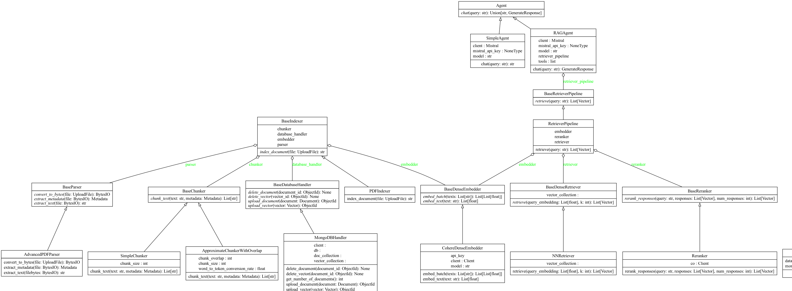
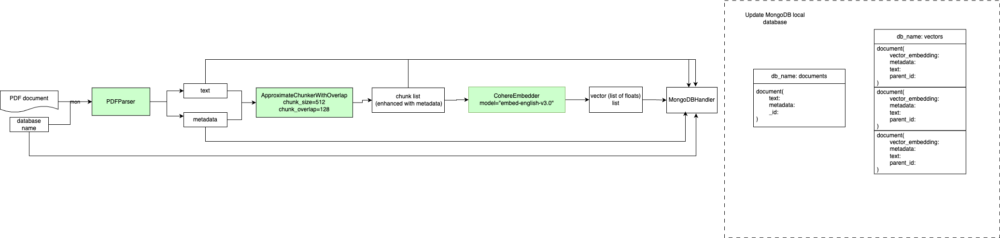
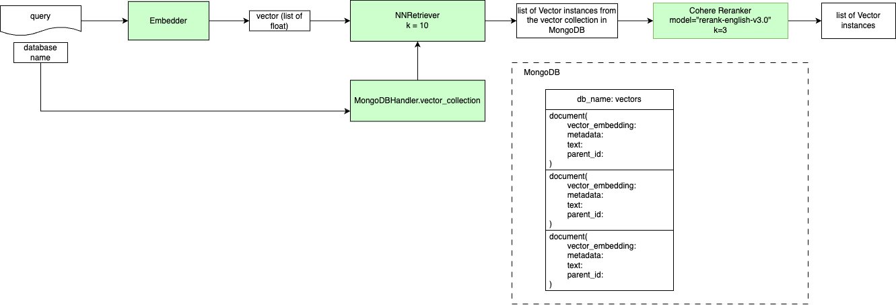
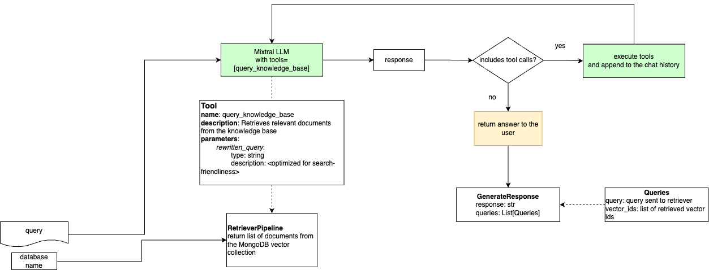

# Agentic RAG Pipeline with custom vectorstore in MongoDB

This is an MVP of an agentic RAG pipeline with a custom vectorstore in MongoDB.
It is built using FastAPI and MongoDB, as well as Docker.
It uses custom indexing, retrieval, and generation pipelines, as well as an agentic framework to query the knowledge base.
The RAG agent supports answering complex questions that require multiple steps to answer.


## Installation and running the app

### Running the app
1. Install docker in your machine. In Mac you should install docker desktop: https://www.docker.com/products/docker-desktop/
2. Clone the repo
3. Run `make up` on your terminal to run the app. What this does is:
    - Starts a MongoDB docker container in your local port 27018. This container will be used as the vector database. It has persistent storage in your machine, so it will keep the data even after the container is stopped.
    - Starts the FastAPI docker container, which runs the app on port 8000.
The MongoDB container will not contain any database by default. When uploading a document, you should provide the name of the database to use. This will create the database if it does not exist.
The structure of the MongoDB database is explained in the [MongoDB structure](#mongodb-structure) section.

### Usage
The app provides three endpoints:

1. **Upload endpoint.**

    This endpoint allows you to upload a PDF file to the app. It will automatically index the document and store the chunks in the vector database.

    The input is a Pydantic object with two fields:
    - `file`: the PDF file to upload.
    - `db_name`: the name of the database to use. Here you can customize your database name, which in production would be the name of the tenant. This allows you to have multiple databases in the same MongoDB instance.

    The output is a Pydantic object with the following fields:
    - `parent_document_id`: the id of the document in the `documents` collection.

    Example:
    ```python
    import requests
    pdf_paths = [
        "examples/pdfs/ACME_Earnings.pdf",
        "examples/pdfs/hr_manual.pdf"  # Add another PDF for testing
    ]
    files = []
    for pdf_path in pdf_paths:
        files.append(
            (
                "files",
                (pdf_path.split("/")[-1], open(pdf_path, "rb"), "application/pdf")  # noqa: E501
            )
        )

    # Add db_name as a parameter
    params = {
        "db_name": "test"  # Using test database for testing
    }
    response = requests.post(
        "http://0.0.0.0:8000/upload/",
        files=files,
        params=params
    )
    ```

2. **Delete endpoint.** 

    This endpoint allows you to delete a document from the app. It will delete the document from the `documents` and `vectors` collections of the `tenant1` database.
    The input is a Pydantic object with two fields:
    - `document_id`: the id of the document to delete.
    - `db_name`: the name of the database to use.
    You should provide the `document_id` of the document to delete. This is the id of the document in the `documents` collection. The vector embeddings associated with the document are also deleted automatically.

    The output is a Pydantic object with the following fields:
    - `message`: the message of the response.

    Example:
    ```python
    import requests
    response = requests.delete(
            "http://0.0.0.0:8000/delete/",
            json={"document_id": "1234567890", "db_name": "tenant1"})
        ```

3. **Generate endpoint.**

    This endpoint allows you to query the app with a natural language question. It will use the RAG agent to answer the question.

    The input is a Pydantic object with two fields:
    - `query`: the question to query the app with.
    - `db_name`: the name of the database to use.


    The output is a Pydantic object with the following fields:
    - `response`: the answer to the question.
    - `queries`: the queries made to the knowledge base to answer the question. This is also a Pydantic object with the following fields:
        - `query`: the question made to the knowledge base.
        - `retrieved_ids`: the ids of the documents retrieved from the knowledge base.
            This field is useful to understand how the answer was retrieved, and to provide citations if needed in the frontend.
    
    Example:
    ```python
    import requests
    response = requests.post(
        "http://0.0.0.0:8000/generate/",
        json={"query": "What were the R&D costs?", "db_name": "tenant1"})
    ``` 
Alternatively, use the FASTAPI UI by going to `http://0.0.0.0:8000/docs` and clicking on `Try it out` under the various endpoints.

I have attached some example PDFs in the `examples/pdfs` folder. You can run the scripts in the `examples/` folder to upload them to the app and test the functionality.
### Running tests
The code is highly modularized and designed to be extended to support more features. To this end, each module of the code is also fully tested using pytest.
When adding new features, such as new sparse retrievers, or parsing of new file types, you should also add tests for the new functionality.

To run the tests, first create a Python virtual environment and install the dependencies with `make install`.
You can run the tests with `make test`. Please note that the tests require some data to be uploaded to the test_tenant1 database. You can do this with the `upload_files.py` script in the `examples/` folder. Future work should include automating this process.

## Design and documentation

### Code Structure
The code is structured following the SOLID principles. Each module has its own responsibility and is designed to be closed for modification but open for extension.
The folder structure of the code is the following:
```
src/
├── agents/
├── chunkers/
├── database_handlers/
├── embedders/
├── indexers/
├── models/
├── parsers/
├── retrievers/
├── routes.py
└── models.py

```
The `routes.py` file contains the API routes of the app.
The `models.py` file contains the Pydantic models of the app.   
The rest of the files are the modules of the app.

### Class diagram
You can automatically generate a class diagram of the app using the following command:
```bash
brew install graphviz
pip install graphviz
pip install pylint
cd src/
pyreverse -o png -p rag-pipeline src .
```
This will generate a class diagram and save it in the `diagrams` folder.




### Development pipeline
The development pipeline is the following:
1. Add/modify the code in the `src/` folder. The code should respect SOLID principles. It should also include `typeguard` for strong type checking during runtime.
2. Add tests for the new functionality.
2. Run `make test` to run the tests and check that the code still works. This will also run quality checks for the code:
    - Check that the code respects the PEP style guide with `flake8`.
    - Check that the code respects the PEP type hints with `mypy`.
3. Run `make up` to run the app locally and test the changes.

### MongoDB structure
Within each database, there are two collections: `documents` and `vectors`.
- `documents` contains the original documents uploaded to the app. This is kept for referencing and also in case the documents should be re-indexed if the indexing strategy changes. Currently re-indexing is not supported, but it would be easy to add another endpoint for this purpose. Specifically, it contains the following fields:
    - `document_id`: the id of the document.
    - `text`: the text of the document.
    - `metadata`: the metadata of the document.
    - `_id`: the id of the MongoDB object (generated by MongoDB)
- `vectors` contains the vector embeddings of the document chunks. Specifically, it contains the following fields:
    - `parent_document_id`: the id of the document that the vector belongs to.
    - `vector_embedding`: the vector embedding.
    - `vector_id`: the id of the vector.
    - `metadata`: the metadata of the vector.
    - `_id`: the id of the MongoDB object (generated by MongoDB)
- The `metadata` object, which is present in both `documents` and `vectors` collections, contains the metadata of the document. Specifically, it contains the following fields:
    - `title`: the title of the document.
    - `author`: the author of the document.
    - `description`: the description of the document.
    - `keywords`: the keywords of the document.
    - `created_at`: the date the document was created.


### Indexing pipeline
The indexing pipeline is defined in the `PDFIndexer` class. This class uses composition of classes to index a PDF document. The indexing pipeline is the following:



1. Upload a PDF document through the `/upload` endpoint. You should provide the name of the database to use.
2. The document is parsed and the metadata is extracted by the `DocumentParser` class.
3. The document is chunked into smaller chunks with an overlap of 128 words by the `Chunker` class. The chunks are enhanced with the document metadata following the pattern:
    ```
    Title: ...
    Author: ...
    Description: ...
    ...
    {chunk}
    ```
4. Each chunk is embedded into a vector embedding by the `Embedder` class.
5. The document metadata and the vector embeddings are stored in the `documents` and `vectors` collections of the database you provided.


### Retrieval pipeline
The retrieval pipeline is defined in the `RetrieverPipeline` class. This class uses composition of classes to retrieve the most similar chunks to a query. The retrieval pipeline is the following:



1. Query the app through the `/query` endpoint.
2. The query is embedded into a vector embedding by the `Embedder` class.
3. The query vector embedding is used to find the most similar vector embeddings in the `vectors` collection of the provided database. This is handled by the `NNRetriever` class.
The indices of the top k most similar vectors are retrieved.
4. The chunks are reranked based on their relevance to the query by the `Reranker` class.


#### Nearest neighbor search with MongoDB
The nearest neighbor search is implemented using MongoDB's aggregation framework. An aggregation pipeline is a specific flow of operations that processes, transforms, and returns results.
In this case, the pipeline is used to compute the cosine similarity between the vector embedding and the query embedding, and then sort the results by the cosine similarity to retrieve the top k most similar vectors.

This ensures that the nearest neighbor search is efficient and scalable by using MongoDB's capabilities to perform the search.


### Generation pipeline: Agentic RAG
The generation pipeline is defined in the `RAGAgent` class. This class uses composition of classes to generate an answer to a query. The generation pipeline is the following:



Main components:
- **RAG agent:** This is the agent that generates an answer to a query. It is defined in the `RAGAgent` class:
    -  **Tool calling** It uses Mixtral with tool calling to generate an answer to the query. It has one tool available: the `query_knowledge_base` tool, which is has an argument `rewritten_query`, which is the query to search the knowledge base with. This query is rewritten to be more effective for search using the `rewrite_query` method in the `RAGAgent` class.
    - **Retriever pipeline** The `query_knowledge_base` tool uses the `RetrieverPipeline` class to retrieve the most similar chunks to the query. This is defined in the `_query_knowledge_base` method in the `RAGAgent` class.
    - **Flow**. The agent first reads the query of the user and decides whether it should be answered by searching the knowledge base or it can be answered by the LLM directly. To search the knowledge base, it can generate multiple tool calls to the `query_knowledge_base` tool, which are executed and their results are appended to the chat history. After the tools are executed, the outputs are appended to the chat history as `ToolMessage`objects, and the agent is called again with the new chat history to answer the user query. Once no more tools are needed, the agent finishes its execution and returns the final answer to the user query.
- **Breaking down complex queries** This agentic flow allows the user to combine information from multiple parts of the knowledge base to answer the query. For example, if the user asks "How much was spent on R&D and what were the technological advancements?", the agent will first search for "How much was spent on R&D" and then search for "What were the technological advancements?". Then the search results will be combined to answer the query.


## Additional questions not covered in the report
1. How would you combine it with keyword-based retrieval?
    Keyword search is typically done by using sparse retrieval methods, which use sparse embeddings computed through algorithms such as TF-IDF.
    Therefore to support sparse retrieval, several changes would be needed:
    - During indexing, the sparse embeddings for the chunks should also be computed and stored in the `vectors` collection (under a new field, e.g. `sparse_embedding`). Please note that if more documents are uploaded in the future, the sparse embeddings will need to be recomputed and stored in the `vectors` collection.
    - Then we should define a new `HybridRetriever`class (base class: `BaseRetriever`) that computes both:
        - The cosine similarity between the query embedding and the dense vector embeddings.
        - The cosine similarity between the query embedding and the sparse vector embeddings.
        - The final similarity score is a weighted sum of the two similarity scores.
    Unfortunately I didn't have more time to implement this, but it should not be too difficult to implement with the current design.

2. How to speed up search?
Right now, the search is done through NN search using MongoDB's aggregation framework, which is a O(n) operation.
To speed up the search, we could make use of Approximate Nearest Neighbor (ANN) search. This is a technique to speed up the search by using a tree-based index to quickly find the nearest neighbors.
Implementing such indices from scratch is non-trivial, so I would recommend using a library such as Annoy or Faiss.

3. Which AI tools were used in this project?
I used the Cursor AI IDE as my copilot. It is an amazing tool that I highly recommend to increase the speed of coding.
Link to cursor: https://www.cursor.com/